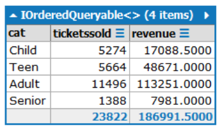
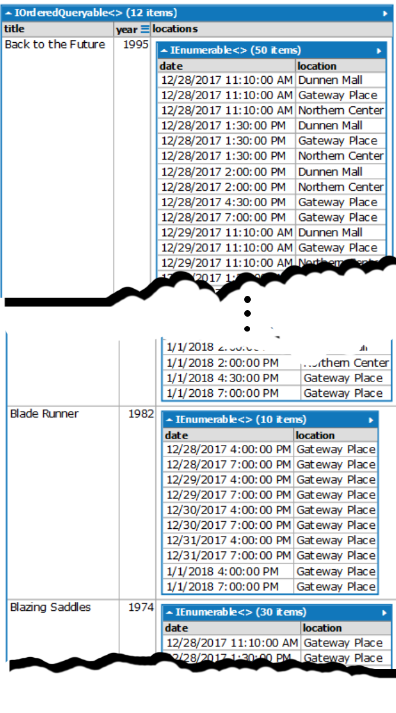
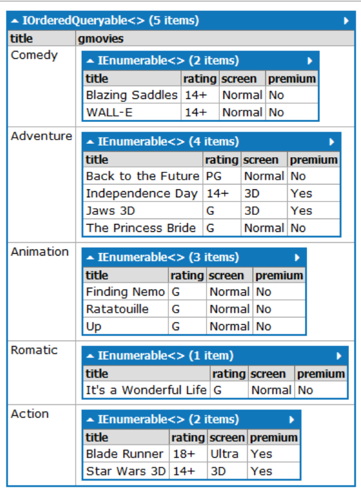
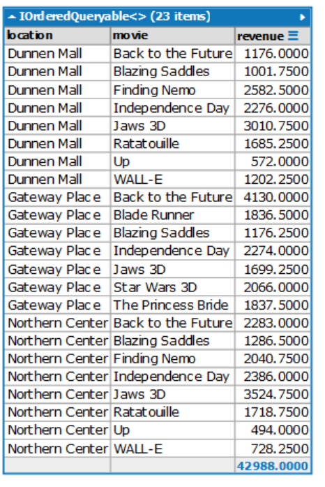

# In-Class Assessment 2 - OMST - 

> LINQ and LinqPad -
> **Read the entire instructions before beginning your work**

> This is an **Open Book** assessment; you are allowed to reference your notes and other online resources.
> 
>  You are **not allowed** to seek the assistance of others or in any way collaborate with others in completing this assessment; doing so may subject you to academic discipline. 

----

## Database

The physical database can be installed from the `.bacpac` file included in the starter kit.

## About OMST

> **Off Main-Street Theatre** is a privately owned theatre located near Down-Town.

## Requirements

In this assessment you are required to implement simple Linq queries for the supplied database. The ERD of the database is at the end of this document. Place each answer in a **separate** LinqPad Query. **Commit your work after completing each question. Failure to do so may result in penalties up to 4 marks.**

The supplied images for each question indicate the needed data to be reported and what your results should look like in terms of structure; detailed values may vary.

1. **(Marks:3)** Show the number of tickets sold and total revenue for each ticket category. The cost of a ticket is its price plus any premium. Show only the categories that have ticket sales. 

    

2. **(Marks:4)** List all movies showing their title and release year. Show unique start date and theatre location of each showing. Order the movies by title and the show locations by datetime. 

    
 
3. **(Marks:4)** Create a list showing movies by Genre description. For each genre show the movie title, rating, required screen type and if it is a premium ticket movie. Order the movies by title. 

   

4. **(Marks:4)** Create a list showing the daily revenues for each movie on a particular date by location. Filter on **Year, Month and Day portions** of the DateTime field. Group report by location description and by movie title. Use the date of Dec 31, 2017 for testing. 

    

----

